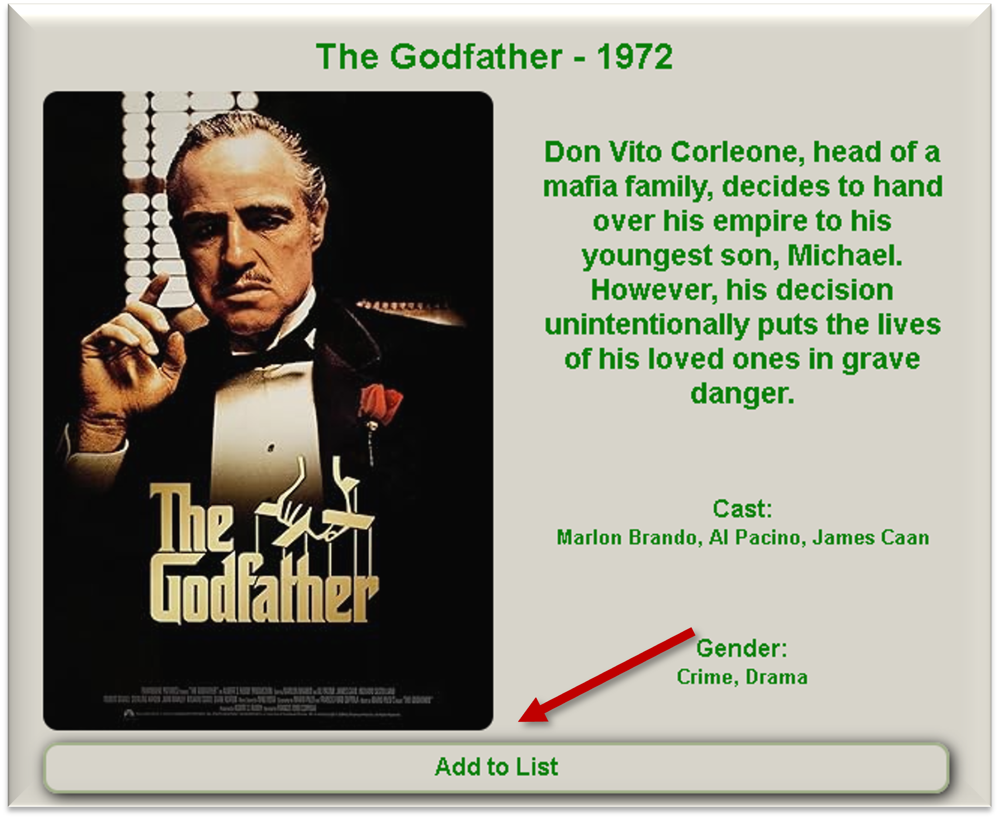

# 🎬 My Film List

Create your own personal film list on the web by simply typing the name and, if needed, the year of the film. This project uses the OMDB API to fetch film details and allows you to manage your list with ease.

## 📜 Description

This project allows users to:

- Search for films by name (and optionally by year).
- Confirm the film details via a modal.
- Add the film to a personal list.
- Persist the list using the browser's local storage, so your list remains even after refreshing the page.

## 🚀 Features

- **OMDB API Integration**: Fetch film details using the OMDB API.
- **JavaScript Logic**: Handle API responses and manage the film list.
- **HTML Modals**: Page's structure and confirm film details before adding to the list.
- **Local Storage**: Save your film list in the browser's local storage.

## 🛠️ Installation

1. **Clone the repository**:

   ```bash
   git clone https://github.com/Lucas-I-Marciano/film-list
   cd your-repo-name
   ```

2. **Get an OMDB API Key**:

   - Create an account on OMDB API.
   - Get your API key.

3. **Create `apiKey.js`**:
   - In the root directory, create a file named `apiKey.js`.
   - Add the following line to the file:
     ```javascript
     const key = "YOUR_API_KEY_HERE";
     ```

## 📂 Project Structure

- `index.html`: The main HTML file that structures the web page. Includes placeholders for dynamic content such as the film list and modals
- `style.css`: Defines the overall look and feel, including fonts, colors, and layout. Ensures a responsive design that works well on various devices.
- `modal.css`: Customizes the appearance of the modal window that confirms film details.
- `script.js`: Handles API requests to OMDB, processes responses, and updates the DOM. Includes functions and manages the local storage
- `apiKey.js`: Contains a single line of code assigning the API key to a constant variable

## 📋 Usage

1. **Open `index.html` in your browser or just open it on [this url](https://lucas-i-marciano.github.io/film-list/)**.
2. **Search for a film** by typing its name (and optionally the year).<br>
   
3. **Confirm the film details** in the modal.<br>
   
4. **Add the film** to your list.
5. **Refresh the page** and see that your list persists!

## 🤝 Contributing

Contributions are welcome! Please fork this repository and submit a pull request for any improvements or bug fixes.

---

Feel free to customize this README.md file further to suit your project's needs. Happy coding! 🎉
